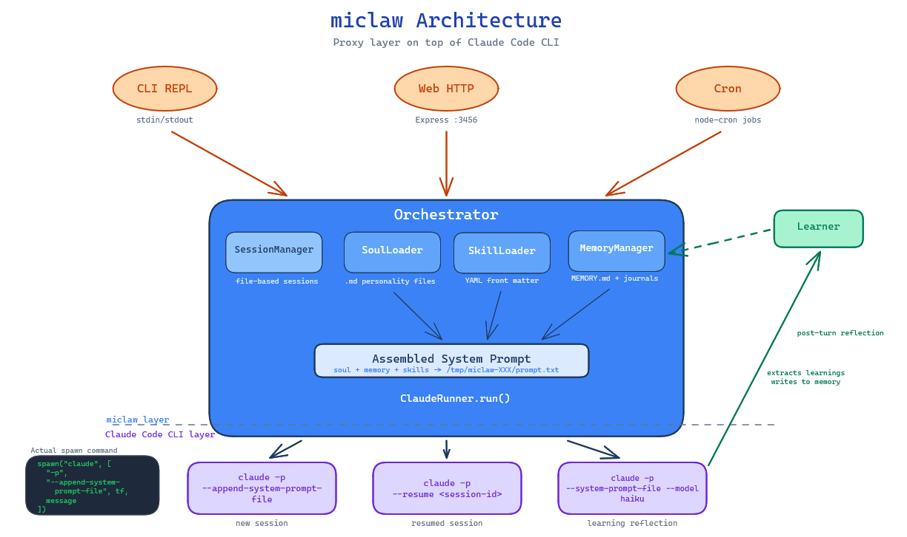

# miclaw

A minimal agentic bot framework that proxies to Claude Code's CLI. Built for learning how agent systems work from the inside out.

miclaw sits between your users and Claude Code, adding the things a raw CLI doesn't give you: persistent sessions, personality files, scheduled tasks, self-learning, multi-channel delivery, and a security layer that actually kills the process if the LLM tries to read your SSH keys.

## Why this exists

Most agent frameworks hide the interesting parts behind abstractions. miclaw exposes them. Every concept maps to a file you can read, modify, or replace:

- **Soul** = markdown files concatenated into a system prompt
- **Memory** = a directory of journals and learnings the agent writes to
- **Skills** = markdown files with YAML frontmatter that gate on binaries, env vars, and OS
- **Sessions** = a JSON file that maps channel:user:agent triples to Claude session IDs
- **Security** = a real-time NDJSON stream parser that watches what the LLM does and intervenes

No magic. No hidden state. If you want to understand how an agent framework works, read `src/orchestrator.ts` — it's the whole thing in one file.

## Architecture



```
Layer 3 (Surface)       CLI channel, Web channel, Telegram channel, Cron scheduler, Tunnel, Entry point
    |
Layer 2 (Coordination)  Orchestrator, SessionManager, Learner
    |
Layer 1 (Core)          ClaudeRunner, SoulLoader, MemoryManager, SkillLoader
    |
Layer 0 (Types)         types.ts, config.ts
```

Imports go down, never up. No circular dependencies. Each layer only talks to the one below it.

## Getting started

You need [Claude Code](https://docs.anthropic.com/en/docs/claude-code) installed and authenticated.

```bash
npm install
npm start
```

That's it. miclaw loads `miclaw.json`, registers a default assistant agent, starts the CLI REPL and a web server on `:3456`.

```bash
npm run dev    # watch mode
npm test       # vitest
```

### Docker

You can also run miclaw as a container. The web channel is the primary interface in this mode. The Dockerfile uses `miclaw.docker.json` which binds the web server to `0.0.0.0` (instead of `127.0.0.1`) so Docker port mapping works, and disables the CLI channel.

First, make sure you've authenticated Claude Code on your host:

```bash
claude login
```

Then build and run with Docker Compose (recommended):

```bash
docker compose up -d --build
```

Or manually with `docker run`:

```bash
docker build -t miclaw .
docker run -d \
  -p 3456:3456 \
  -v ~/.claude:/home/node/.claude \
  -v ~/.claude.json:/home/node/.claude.json \
  -v $(pwd)/memory:/app/memory \
  -v $(pwd)/sessions:/app/sessions \
  -v $(pwd)/logs:/app/logs \
  --name miclaw \
  miclaw
```

Claude Code needs both `~/.claude/` (credentials and runtime state) and `~/.claude.json` (config) mounted into the container. The OAuth flow requires a browser, so `claude login` has to happen on the host first.

If you prefer using an API key instead, replace the two Claude mounts with `-e ANTHROPIC_API_KEY`.

Volume mounts keep state persistent across container restarts:

| Mount | Purpose |
|-------|---------|
| `./memory` | Long-term memory, daily journals, learnings |
| `./sessions` | Session tracking (user/agent/channel) |
| `./logs` | Security audit trail (`audit.jsonl`) |

You can also mount a custom config or soul:

```bash
-v $(pwd)/my-config.json:/app/miclaw.json \
-v $(pwd)/my-soul:/app/soul
```

**Using the CLI from outside the container:**

The CLI channel reads from stdin, so you can attach to it interactively:

```bash
docker exec -it miclaw npx tsx src/index.ts  # starts a second instance with CLI
```

Or send one-off messages by piping directly to Claude Code inside the container:

```bash
docker exec miclaw claude -p "What's in my memory?"
```

The second approach skips miclaw's orchestration (no session tracking, no soul, no learning). For full CLI access with all miclaw features, the best option is to keep the CLI channel enabled and use `docker attach miclaw` — but note that detaching without stopping requires `Ctrl+P Ctrl+Q`.

## How a message flows

```
1. User types "Hello" in the CLI
2. CLIChannel calls orchestrator.handleMessage()
3. Orchestrator:
   - Validates input, checks rate limits
   - Finds or creates a session (cli:local:assistant)
   - Assembles the soul: AGENTS.md + SOUL.md + memory + learnings + skills
   - Spawns: claude -p --output-format stream-json --append-system-prompt "..." "Hello"
4. ClaudeRunner:
   - Parses NDJSON in real time
   - Security module watches every line for path/URL violations
   - Returns {result, sessionId, cost, durationMs}
5. Orchestrator:
   - Updates session (turn count, last active, Claude session ID)
   - Writes to journal
   - Optionally triggers self-learning via haiku
6. CLI prints the response
```

## Key concepts

### Agents

Defined in `agents.json`. Each agent gets its own soul directory, skills, model, and tool restrictions.

```json
{
  "code-reviewer": {
    "description": "Reviews pull requests and suggests improvements",
    "soulDir": "./souls/reviewer",
    "skills": ["github-pr", "style-checker"],
    "model": "sonnet",
    "allowedTools": ["Read", "Glob", "Grep", "WebFetch"]
  }
}
```

### Soul

The agent's personality and instructions. Drop markdown files into a soul directory:

| File | Purpose |
|------|---------|
| `AGENTS.md` | Role and identity (required) |
| `SOUL.md` | Style and behavior rules (required) |
| `IDENTITY.md` | Background context (optional) |
| `TOOLS.md` | Tool-specific guidance (optional) |

These get concatenated and injected as Claude's system prompt. Change the files, change the agent.

### Memory

Three tiers, all plain files:

- `MEMORY.md` — long-term memory you or the agent writes to
- `journals/` — timestamped daily logs of conversations
- `learnings.md` — patterns the agent extracts from its own conversations using a haiku reflection step

### Skills

A skill is a markdown file with YAML frontmatter in `skills/<name>/SKILL.md`:

```yaml
---
name: "github-pr"
description: "Fetches and analyzes GitHub pull requests"
allowed-tools: ["Read", "WebFetch", "Grep"]
requires:
  bins: ["gh"]
  env: ["GITHUB_TOKEN"]
  os: ["linux", "darwin"]
---
# Instructions for the agent go here
When reviewing a PR, fetch the diff with `gh pr diff` and focus on:
- Breaking API changes
- Missing test coverage
- Security issues in new dependencies
```

If the prerequisites aren't met (missing binary, missing env var, wrong OS), the skill silently stays out of the prompt. No runtime errors.

### Sessions

miclaw tracks sessions so conversations persist across turns. A session key is `channelId:userId:agentId`. When a session hits `maxTurnsPerSession`, it rotates to a fresh one — the old context is gone, but memory and learnings carry forward.

Under the hood, this maps to Claude Code's `--resume` flag.

### Channels

Three built-in delivery channels:

- **CLI** — interactive readline REPL. Trusted. No rate limits. Full tool access.
- **Web** — HTTP server with a chat UI and admin dashboard. Untrusted. Restricted tools, rate limited, audit logged.
- **Telegram** — long-polling bot via `node-telegram-bot-api`. Untrusted. Restricted tools, rate limited, chat ID allowlisting.

The `Channel` interface is four methods:

```typescript
interface Channel {
  readonly name: string;
  start(): Promise<void>;
  stop(): Promise<void>;
  onMessage(handler: MessageHandler): void;
  send(userId: string, message: string): Promise<boolean>;
}
```

### Cron

Scheduled autonomous tasks via `cron/jobs.json`:

```json
{
  "daily-review": {
    "schedule": "0 9 * * *",
    "agent": "assistant",
    "message": "Review pending items for {{DATE}}",
    "enabled": true,
    "outputMode": "journal"
  }
}
```

Template variables (`{{DATE}}`, `{{JOURNALS_LAST_N}}`) get resolved at execution time.

### Security

Eight layers, each independently configurable per channel:

| Layer | What it does |
|-------|-------------|
| Input validation | Message length caps, character allowlists on IDs, path traversal detection |
| Tool restrictions | Allowlist per channel (web gets Read/Glob/Grep only, no Bash/Write) |
| Path enforcement | Real-time stream parsing kills the process on blocked path access |
| URL enforcement | Hostname allowlist/blocklist with wildcard support |
| Rate limiting | Per-user sliding window (configurable per channel) |
| Cost limits | Post-hoc check per request, kills on threshold |
| Memory isolation | System-read files vs agent-written files tracked separately |
| Audit logging | Every tool use, violation, and request logged to `logs/audit.jsonl` |

By default, agents can only read and write within the project directory. Sensitive paths like `~/.ssh`, `~/.aws`, `~/.gnupg`, `~/.config`, and `/etc/shadow` are blocked even if you widen access. These defaults are set in `src/config.ts` and can be overridden per-channel via the `security` section in `miclaw.json`. See [SECURITY.md](SECURITY.md) for the full threat model, configuration options, and deployment guidance.

### Cloudflare Tunnel

miclaw can expose the web channel to the internet via [Cloudflare Tunnels](https://developers.cloudflare.com/cloudflare-one/connections/connect-networks/), so you can access your agent from anywhere without port forwarding, static IPs, or firewall rules.

You need `cloudflared` installed on the host (or use the Docker image, which includes it).

**Quick tunnel** — the simplest option. No Cloudflare account needed. You get a random `https://xyz.trycloudflare.com` URL that changes on every restart:

```json
{
  "tunnel": {
    "enabled": true,
    "mode": "quick"
  }
}
```

Start miclaw and the tunnel URL will be printed to the console:

```
[tunnel] Starting cloudflared quick tunnel → http://127.0.0.1:3456
[tunnel] Tunnel active: https://random-words-here.trycloudflare.com
[tunnel] Public URL: https://random-words-here.trycloudflare.com
```

**Named tunnel** — persistent hostname that survives restarts. Requires a Cloudflare account and a domain managed by Cloudflare.

First, set up the tunnel with `cloudflared`:

```bash
# Authenticate with Cloudflare (opens browser)
cloudflared tunnel login

# Create a tunnel
cloudflared tunnel create miclaw

# Route DNS — point your subdomain to the tunnel
cloudflared tunnel route dns miclaw miclaw.example.com
```

Then configure miclaw to use it:

```json
{
  "tunnel": {
    "enabled": true,
    "mode": "named",
    "tunnelName": "miclaw",
    "hostname": "miclaw.example.com",
    "credentialsFile": "/home/you/.cloudflared/<tunnel-id>.json"
  }
}
```

All tunnel config values support environment variable substitution (`${VAR_NAME}`), so you can keep credentials out of the config file:

```json
{
  "tunnel": {
    "enabled": true,
    "mode": "named",
    "tunnelName": "${CF_TUNNEL_NAME}",
    "hostname": "${CF_TUNNEL_HOSTNAME}",
    "credentialsFile": "${CF_TUNNEL_CREDENTIALS}"
  }
}
```

The full set of tunnel options:

| Option | Default | Description |
|--------|---------|-------------|
| `enabled` | `false` | Enable/disable the tunnel |
| `mode` | `"quick"` | `"quick"` for ephemeral URL, `"named"` for persistent hostname |
| `tunnelName` | — | Name of the tunnel (named mode only) |
| `hostname` | — | Public hostname (named mode only) |
| `credentialsFile` | — | Path to tunnel credentials JSON (named mode only) |
| `protocol` | `"http"` | Protocol for the local origin (`"http"` or `"https"`) |
| `port` | web channel port | Local port to tunnel (defaults to `channels.web.port`) |
| `host` | web channel host | Local host to tunnel (defaults to `channels.web.host`) |
| `extraArgs` | `[]` | Additional arguments passed to `cloudflared` |

If the tunnel fails to start (e.g. `cloudflared` not installed), miclaw logs a warning and continues — the web channel remains accessible locally.

**Security note:** Exposing miclaw to the internet means untrusted users can interact with your agent. Make sure you have appropriate security settings: enable API key auth on the web channel, review your tool allowlists, and configure rate limits. See [SECURITY.md](SECURITY.md) for guidance.

## Configuration

Everything lives in `miclaw.json`:

```json
{
  "defaultAgent": "assistant",
  "defaultModel": "sonnet",
  "soulDir": "./soul",
  "skillsDir": "./skills",
  "memoryDir": "./memory",
  "sessionsDir": "./sessions",
  "journalDays": 3,
  "maxTurnsPerSession": 20,
  "sessionTtlDays": 30,
  "channels": {
    "cli": { "enabled": true, "prompt": "you> " },
    "web": { "enabled": true, "port": 3456, "host": "127.0.0.1" },
    "telegram": { "enabled": false }
  },
  "cron": { "enabled": true, "jobsFile": "./cron/jobs.json" },
  "learning": {
    "enabled": true,
    "model": "haiku",
    "afterEveryTurn": false
  },
  "tunnel": { "enabled": false, "mode": "quick" }
}
```

You can also pass a config path: `npm start /path/to/config.json`

## Project structure

```
src/
  index.ts          Entry point — wires everything together
  orchestrator.ts   Central hub: routes messages, assembles souls, manages lifecycle
  runner.ts         Spawns claude -p subprocesses, parses NDJSON streams
  soul.ts           Reads and concatenates soul markdown files
  memory.ts         Manages MEMORY.md, journals, learnings
  skills.ts         Loads SKILL.md files with frontmatter validation
  session.ts        File-based session persistence
  learner.ts        Post-turn reflection via haiku
  cron.ts           Scheduled job execution with template variables
  security.ts       PathEnforcer, UrlEnforcer, RateLimiter, AuditLogger
  tunnel.ts         Cloudflare Tunnel management (cloudflared subprocess)
  config.ts         Config loading, defaults, security profiles
  types.ts          All type definitions and error classes
  channels/
    cli.ts          Interactive readline REPL
    web.ts          HTTP server, chat UI, admin dashboard, SSE streaming
    telegram.ts     Telegram bot via long polling
soul/               Default agent personality files
skills/             Skill definitions (markdown + YAML frontmatter)
memory/             Long-term memory and journals
sessions/           Session state persistence
cron/               Scheduled job definitions
tests/              Full test suite (vitest)
```

## Tests

```bash
npm test
```

Covers every module: runner, orchestrator, sessions, memory, soul, skills, config, cron, security, and web channel. Uses vitest with mocked subprocesses — no Claude API calls during testing.

## Learning from the code

If you're here to understand agent frameworks, start with these files in order:

1. **`src/types.ts`** — every data shape in the system
2. **`src/soul.ts`** — how personality gets assembled from files
3. **`src/runner.ts`** — how the LLM actually gets called (subprocess + NDJSON parsing)
4. **`src/orchestrator.ts`** — how messages flow through the system
5. **`src/session.ts`** — how conversation state persists
6. **`src/memory.ts`** — how agents remember across sessions
7. **`src/learner.ts`** — how agents extract patterns from their own conversations
8. **`src/security.ts`** — how you stop the LLM from doing things it shouldn't

Each file is one concept. No file exceeds a few hundred lines.
